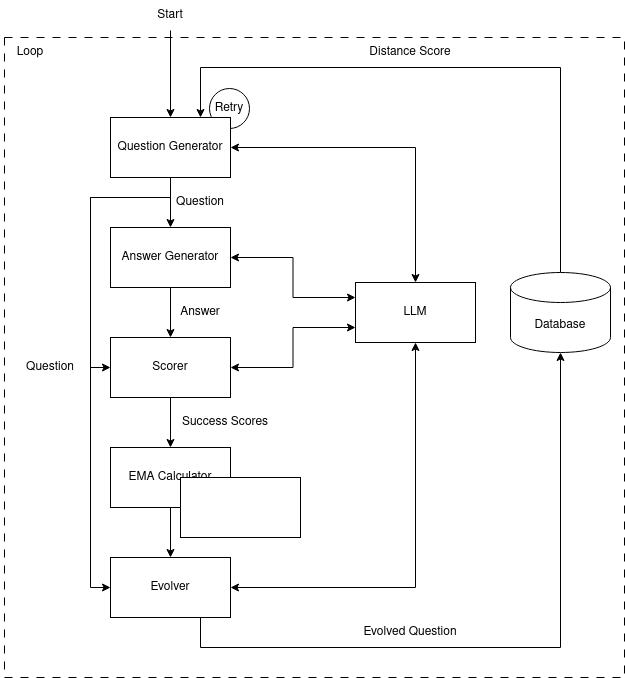

# EVOGEN
This is a self-evolving benchmark generator project. The idea is to have a generator that adheres to the following requirements:

- User to supply an OpenAI API–compatible endpoint (to be used for the question generation, the question answering, and the evaluation)
- Every question should be novel
- Consider how you might maximize the utility of such a system
- The score should be an exponential moving average

# System diagram

The proposed implementation has the following components:
- Question generator
- Answer generator
- Scorer
- EMA calculator
- Evolver

The system runs forever, unless Ctrl+C is hit, where the stored questions in the database will be printed out, and the scores are stored in a file so that one can continue the process later.



# Work flow

The system starts by connecting to the target LLM, loading the database and the scores. Then it calls `question_generator` to generate the first question; if the question is too similar to those in the database, it will retry generating a new question, considering the `novelty_threshold` in `configs/evogen.json`. This retry process happens as many times as set in the `evogen.json` file under `retry`.

Then, `response_generator` is called to generate an answer to the input question. Later, the question and the corresponding answer are passed to the `scorer` (i.e. LLM-as-a-judge) to get a score from 0 to 1, where 0 represents a wrong and irrelevant answer, and 1 represents a complete and correct answer.

Now, we keep track of the scores to calculate the Exponential Moving Average (EMA) using the `span` value in `configs/evogen.json`. Then, the current EMA and the question are passed to the `evolver` to check where the score is too high ($> 0.75$) or too low ($< 0.25$), and act accordingly. In the former case, the question is passed to the LLM to generate a more difficult question, since, based on the score, the model was able to solve it easily. In the latter case, the question is returned to the model to generate a simpler version.

Finally, the evolved question is stored in the database. And in case of an interruption in the code execution, all stored questions are printed to the console, and the scores are stored in `db/scores.json`. This would provide the option to resume this process at a later time.

# How to run

To run the code, create the environment using:

```bash
conda env create -f environment.yml
```

Activate the environment using:

```bash
conda activate evogen
```

Then, set the preferred values in the `configs/evogen.json` and `configs/model.json`.

Finally, run the code by executing the following command:

```bash
python main.py
```

You can interrupt the execution at anytime by hitting Ctrl+C.

# To-do
- [ ] Implement unittest